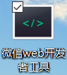
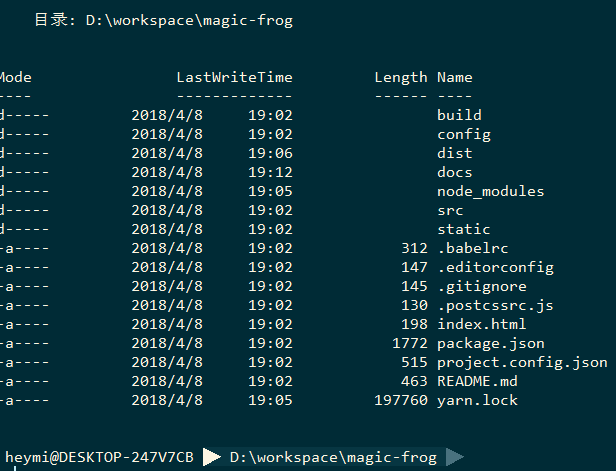
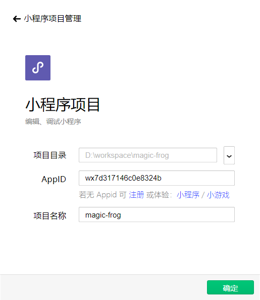
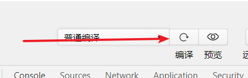
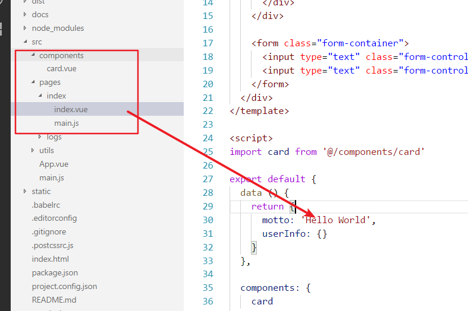
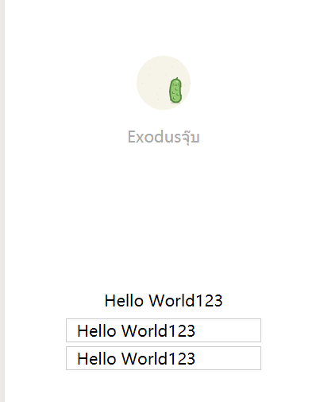
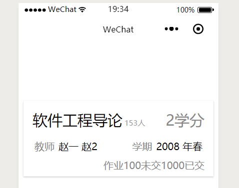

## 准备环境

这里假设你已经配置好了nodejs和npm包管理器了。

```
> npm -v
5.6.0
```

全局安装`yarn`

```
npm install -g yarn
```

之后安装微信开发者工具。

https://developers.weixin.qq.com/miniprogram/dev/devtools/download.html



## 开始项目

### 克隆&安装依赖



```
yarn --dev #安装依赖
yarn dev   #进入开发模式
```

### 配置小程序开发工具



点击确定&点击远程调试



之后就可以愉快的敲代码了！

比如

修改`pages/index/index.vue`中的`Hello World`->`Hello World123`&保存 。



 之后自动发生了变化。颈部惊喜！意不意外！



## 小试牛刀

修改`src/components/card.vue`

```vue
<template>
<div class="lesson-card">
    <div class="lesson-card-header">
        <p class="lesson-card-title">{{classTitle}}</p>
        <p class="lesson-card-title-small">{{peopleCount}}人</p>
        <div class="lesson-card-title-spacer"></div>
        <p class="lesson-card-title-right">{{point}}学分</p>
    </div>
    <div class="lesson-card-content">
        <p class="lesson-card-content-label">教师</p>
        <p class="lesson-card-content-value">{{teachers}}</p>
        <div class="lesson-card-content-spacer"></div>
        <p class="lesson-card-content-label">学期</p>
        <p class="lesson-card-content-value">{{term}}</p>
    </div>
    <div class="lesson-card-footer">
        <p>作业</p>
        <p class="lesson-card-p-big">{{hwFinished}}</p>
        <p>未交</p>
        <p class="lesson-card-p-big">{{hwUnFinished}}</p>
        <p>已交</p>
    </div>
</div>
</template>

<script>
export default {
  props: {
    classTitle:String,
    peopleCount:Number,
    point:Number,
    teachers:String,
    term:String,
    hwFinished:Number,
    hwUnFinished:Number
  }
}
</script>
```

模板语法&相关知识参考

https://cn.vuejs.org/v2/guide/syntax.html

再修改`index.vue`

```vue
<template>
  <div class="container" @click="clickHandle('test click', $event)">
  <card classTitle="软件工程导论" peopleCount=153 point=2 teachers="赵一 赵2" term="2008 年春" hwFinished=100 hwUnFinished=1000 />
  </div>
</template>

```

看眼效果


有点丑，加上样式。。。在`card.vue`中

```vue
<style>
.lesson-card {
    margin:0.5em;
    padding:0.5em;
    width:90%;
    box-shadow: 0 2px 2px 0 rgba(0,0,0,.14), 0 3px 1px -2px rgba(0,0,0,.2), 0 1px 5px 0 rgba(0,0,0,.12);
    display:flex;
    flex-flow:column nowrap;
    justify-content: space-around;
    align-items:stretch;
}
.lesson-card-header{
    padding:.4em;
    display:flex;
    flex-flow:row nowrap;
    justify-content: space-between;
    align-items:baseline;
}
.lesson-card-title-spacer{
    flex-grow:1;
}
.lesson-card-title{
    font-size:1.5em;
}
.lesson-card-title-small{
    margin-left:0.25em;
    font-size:0.75em;
    color:#999;
}
.lesson-card-title-right{
    font-size:1.5em;
    color:#888;
}
.lesson-card-content{
    padding:.4em;
    display:flex;
    flex-flow:row nowrap;
    justify-content: space-between;
}
.lesson-card-content-spacer{
    flex-grow:1;
}
.lesson-card-content-label{
    padding:.2em;
    color:#888;
}
.lesson-card-content-value{
    padding:.2em;
}
.lesson-card-footer{
    padding:0 .4em;
    display:flex;
    flex-flow:row nowrap;
    justify-content: flex-end;
    align-items:baseline;
    color:#888;
}
.lesson-card-text-big{
    margin:0 0.5em;
    font-size:1.5em;
    color:#000 !important;
}
</style>
```

按下保存键(emmm Ctrl+S) 233



ok....


先填这么多了。。一边写一遍填。。。如果要说同构的话。。。

## 同构

这个回来再填。。。
